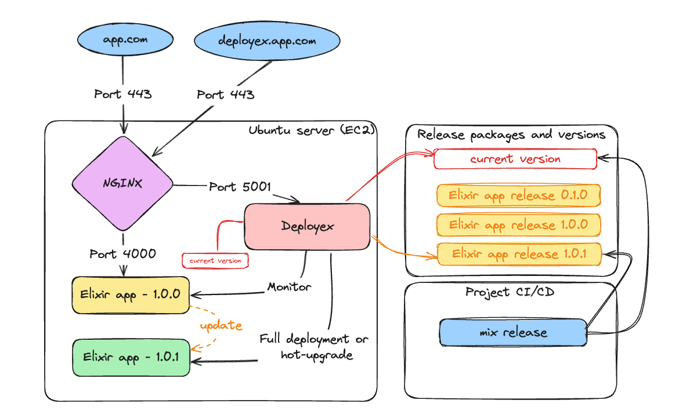
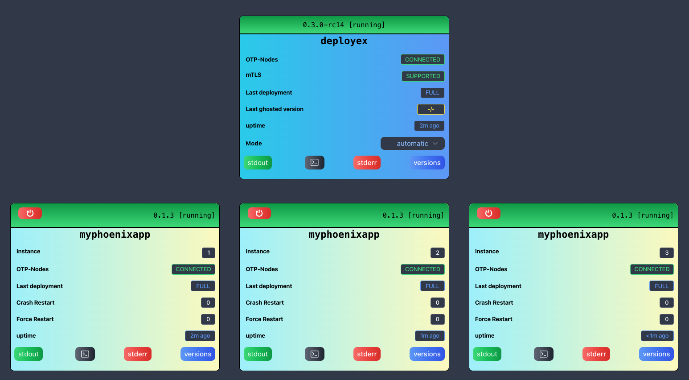
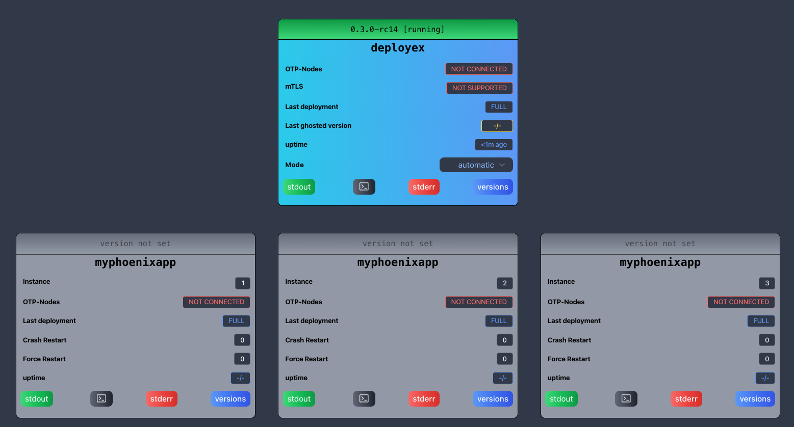

# DeployEx

> Who supervises the supervisor (of your application)?

 [](https://github.com/thiagoesteves/deployex/actions/workflows/pr-ci.yml) 

DeployEx is a lightweight tool designed for managing deployments for Beam applications (Elixir, Gleam and Erlang) without relying on additional deployment tools like Docker or Kubernetes. Its primary goal is to utilize the release package for executing full deployments or hot-upgrades, depending on the package's content, while leveraging OTP distribution for monitoring and data extraction.

DeployEx acts as a central deployment runner, gathering crucial deployment data such as the current version and release package contents. The content of the release package enables it to run for a full deployment or a hot-upgrade. Meanwhile, on the development front, your CI/CD pipeline takes charge of crafting and updating packages for the target release. This integration ensures that DeployEx is always equipped with the latest packages, ready to facilitate deployments.

DeployEx is currently used by:
 * [Calori Web Server](https://github.com/thiagoesteves/calori) for __Elixir__ applications and you can check it at [homepage](https://calori.com.br).
 * [Cochito Web Server](https://github.com/chouzar/cochito) for __Gleam__ applications and you can check it at [homepage](https://gleam.deployex.pro).
 * [Snake Game with Cowboy](https://github.com/thiagoesteves/erlgame) for __Erlang__ applications and you can check it at [homepage](https://erlang.deployex.pro).



Upon deployment, the following dashboard becomes available, providing easy access to logs, the terminal, process observability, and much more for both DeployEx and the monitored applications.

[](https://github.com/user-attachments/assets/188adc35-c022-4061-84ad-0e2d47af614e)

## 🔉 Features

 * Monitors multiple Beam application instances (Elixir/Erlang/Gleam) and automatically restarts them if they crash for any reason.
 * Includes a backoff delay restart mechanism to prevent excessive restarts.
 * Performs full deployments based solely on the release files generated by:
   - `mix release` for Elixir.
   - `gleam export` for Gleam.
   - `rebar3 as prod tar` for Erlang.
 * Supports hot code reloading for:
   - Elixir applications using the [Jellyfish](https://github.com/thiagoesteves/jellyfish) library.
   - Erlang applications using the [rebar3_appup_plugin](https://github.com/lrascao/rebar3_appup_plugin) plugin.
 * Supports the following cloud providers:
   - Amazon Web Services (AWS)
   - Google Cloud Provisioning (GCP)
 * Provides rollback functionality if a monitored app version remains unstable for 10 minutes.
 * Rolled-back monitored app versions are ghosted, preventing their redeployment.
 * Ensures all instances remain connected to the OTP distribution, including DeployEx itself.
 * Supports OTP distribution with mutual TLS (mTLS) for secure monitoring of apps and DeployEx.
 * Provides the ability to run pre-commans prior deployments for Database migrations or any other eval command.
 * Provides a friendly UI that only authenticated users can access.
 * Allows setting a previously configured version in the UI, enabling DeployEx to enforce deployment of a specific version.
 * Supports individual application restarts via the UI, including DeployEx itself.
 * Allows access to current log files (stdout and stderr) for both monitored apps and DeployEx.
 * Provides easy access to the application shell:
   - IEx shell for monitored Elixir apps and DeployEx.
   - Erlang shell for monitored Gleam/Erlang apps.
 * Provides easy access to the host shell (tmux).
 * Provides installer script to be used with ubuntu hosts.
 * Provides status information per instance:
   - OTP connectivity
   - Version history
   - Last deployment status
   - Number of crash restarts
   - Number of forced restarts
 * And much more to come ...

> [!NOTE]
> All examples and deployments in this project use NGINX as a reverse proxy and load balancer. However, DeployEx does not depend on NGINX; it is used here purely for convenience.

## ⚠️ Next steps

### Release Version: 0.3.0 is coming soon!!!

### What is coming for the Release Version: 0.4.0

- [ ] 🚧 Add telemetry support for DeployEx to capture metrics and telemetry via OTP distribution.
- [ ] 💤 Lazy deployments for Phoenix apps (Delay Endpoint start to allow fast switch for full deployments)
- [ ] 💤 Integrate CPU utilization monitoring from the OTP distribution.
- [ ] 💤 Continuous improvement in UI design.

### No version defined yet

- [ ] 💤 Health checks via OTP distribution
- [ ] 💤 Secrets from Environment variables to allow installation on servers with no cloud provider
- [ ] 💤 Orchestrate distributed databasses like [Khepri](https://github.com/rabbitmq/khepri)
- [ ] 💤 Enhance installer to become an elixir app capable of hotupgrade DeployEx

## 📁 Getting Started

### Running the application

You can kickstart the setup with the following commands, the default number of replicas is 3:
```bash
mix deps.get
iex --sname deployex --cookie cookie -S mix phx.server
[info] Initialising deployment server
[info] Running DeployexWeb.Endpoint with Bandit 1.5.7 at 127.0.0.1:5001 (http)
[info] Access DeployexWeb.Endpoint at http://localhost:5001
[watch] build finished, watching for changes...
Erlang/OTP 26 [erts-14.1.1] [source] [64-bit] [smp:10:10] [ds:10:10:10] [async-threads:1] [jit]

Interactive Elixir (1.16.0) - press Ctrl+C to exit (type h() ENTER for help)

Rebuilding...

Done in 390ms.
[error] Invalid version map at: /tmp/myphoenixapp/versions/myphoenixapp/local/current.json reason: enoent
```

Now you can visit [`localhost:5001`](http://localhost:5001) from your browser and enter the credentials for the admin user, *__username: admin password: deployex__*. You should expect the following dashboard:



> [!NOTE]
> The error message in the CLI is due to no monitored app is available to be deployed. If you want to proceed for a local test, follow the steps at [Running DeployEx and Monitored app locally](https://github.com/thiagoesteves/deployex/tree/thi/add-erlang-hot-upgrade-support?tab=readme-ov-file#-running-deployex-locally). Also, it is important to note that the distribution will be required so this is the reason to add `-sname deployex` in the command

### How DeployEx handles monitored application Version/Release

The DeployEx app expects a `current.json` file to be available, which contains version, hash information and any pre-command. This file is mandatory for full deployment and hot upgrades.

#### Version file (current.json) 

Expected location in the release folder:
```bash
# production path
./{bucket}/versions/{monitored_app}/{env}/current.json
# local test path
/tmp/{monitored_app}/versions/{monitored_app}/{env}/current.json
```

Expected JSON format for `current.json`:
```bash
{
  "version": "1.0.0",
  "pre_commands": [ "eval MyApp.Migrator.create", "eval MyApp.Migrator.migrate" ], # optional field
  "hash": "local"
}
```

Once the file is captured, the deployment will start if no app is running or if the current app is running with a version that differs from the `current.json` file.

#### Release package

Expected location in the release folder:
```bash
# production path
./{bucket}/dist/{monitored_app}/{monitored_app}-{version}.tar.gz
# local test path
/tmp/{monitored_app}/dist/{monitored_app}/{monitored_app}-{version}.tar.gz
```
## 🛠️ Production Information

### Environment Variables

DeployEx application typically requires several environment variables to be defined for proper operation. Ensure that you have the following environment variables set when running in production where the ones that have a default value available are not required:

| ENV NAME   |      EXAMPLE      |  SOURCE |  DEFAULT | DESCRIPTION |
|----------|-------------|------:|------|------|
| __DEPLOYEX_SECRET_KEY_BASE__ | 42otsNl...Fpq3dIJ02 | aws or gcp secrets | -/- | secret key used for encryption |
| __DEPLOYEX_ERLANG_COOKIE__ | cookie | aws or gcp secrets | -/- | erlang cookie |
| __DEPLOYEX_ADMIN_HASHED_PASSWORD__ | $2b$1...5PAYTZjNQ42ASi | aws or gcp secrets | -/- | Hashed admin password for authentication |
| __DEPLOYEX_MONITORED_APP_NAME__ | myphoenixapp | system ENV | -/- | Monitored app name |
| __DEPLOYEX_MONITORED_APP_LANG__ | __elixir__, __gleam__ or __erlang__  | system ENV | -/- |  Monitored app language |
| __DEPLOYEX_CLOUD_ENVIRONMENT__ | prod | system ENV | -/- | cloud env name |
| __AWS_REGION__ | us-east2 | system ENV | -/- | the aws region |
| __GOOGLE_APPLICATION_CREDENTIALS__ | /path/to/file.json | system ENV | -/- | the google application credentials path |
| __DEPLOYEX_PHX_HOST__ | example.com | system ENV | -/- | The hostname for your application |
| __DEPLOYEX_PHX_PORT__ | 5001 | system ENV | 5001 | The port on which the application will run |
| __DEPLOYEX_PHX_SERVER__ | true | system ENV | true | enable/disable server |
| __DEPLOYEX_RELEASE_ADAPTER__ | __s3__ or __gcp-storage__ | system ENV | -/- | release adapter type |
| __DEPLOYEX_RELEASE_BUCKET__ | myphoenixapp-prod-distribution | system ENV | -/- | release distribution bucket name |
| __DEPLOYEX_SECRETS_ADAPTER__ | __aws__ or __gcp__ | system ENV | -/- | release adapter type |
| __DEPLOYEX_SECRETS_PATH__ | deployex-myphoenixapp-prod-secrets | system ENV | -/- | secret path to be retrieved from |
| __DEPLOYEX_MONITORED_APP_PORT__ | 4000 | system ENV | 4000 | the initial port for starting the monitored apps |
| __DEPLOYEX_MONITORED_REPLICAS__ | 2 | system ENV | 3 | Number of replicas to monitor |
| __DEPLOYEX_DEPLOY_TIMEOUT_ROLLBACK_MS__ | 600000 | system ENV | 600000 | The maximum time allowed for attempting a deployment before considering the version as non-deployable and rolling back |
| __DEPLOYEX_DEPLOY_SCHEDULE_INTERVAL_MS__ | 5000 | system ENV | 5000 | Periodic checking for new deployments |

For local testing, these variables are not expected or set to default values.

### ☁️ Cloud Providers

DeployEx offers a comprehensive set of Terraform examples for programmatically deploying in AWS and GCP, including detailed step-by-step setup instructions:

 * [AWS deployment for Elixir](docs/examples/aws-elixir/README.md)
 * [GCP deployment for Elixir](docs/examples/gcp-elixir/README.md)
 * [AWS deployment for Gleam](docs/examples/aws-gleam/README.md)

### Installation

If you intend to install DeployEx directly on an Ubuntu server, you can utilize the [installer script](/devops/installer/deployex.sh) provided in the release package. For an example of monitored app, please see the setup for the [Calori Web Server - AWS](https://github.com/thiagoesteves/calori/blob/main/devops/aws/terraform/modules/standard-account/cloud-config.tpl)/[Calori Web Server - GCP](https://github.com/thiagoesteves/calori/blob/main/devops/gcp/terraform/modules/standard-account/cloud-config.tpl). The installer script requires a JSON configuration file, an example of which can be found [here](/devops/installer/deployex-config.json). This JSON file can also export environment variables specific to the monitored applications.

Currently, the release and installation process supports Ubuntu versions 20.04 and 22.04. However, you have the option to manually compile and install DeployEx on your target system.

### Pre-commands (Elixir only)

Your application will likely require database commands, such as migrations. DeployEx handles these through pre-commands specified in `current.json` under the `pre_commands` field. These commands will be executed in the order they are listed, before the application starts. If a pre-command is needed and does not require changes to the application itself, using pre-commands in conjunction with hotupgrade is ideal to avoid unnecessary downtime.

### 🔐 Secrets Requirements

DeployEx uses Secret Manager (AWS or GCP) to fetch its secrets via the config provider. The following environment variable configuration is expected for Secret Manager:

```bash
DEPLOYEX_SECRETS_ADAPTER=gcp
DEPLOYEX_SECRETS_PATH=deployex-myapp-prod-secrets
```

Within the secrets, the following key-value pairs are required:
| ENV NAME | EXAMPLE | DESCRIPTION |
|----------|-------------|------|
| __DEPLOYEX_SECRET_KEY_BASE__ | 42otsNl...Fpq3dIJ02 | mix phx.gen.secret |
| __DEPLOYEX_ERLANG_COOKIE__ | my-cookie | erlang cookie |
| __DEPLOYEX_ADMIN_HASHED_PASSWORD__ | $2b$1...5PAYTZjNQ42ASi | Bcrypt.hash_pwd_salt("my-pass") |

## 🏠 Running DeployEx locally

 * [Elixir Applications](docs/examples/local-elixir/README.md)
 * [Gleam Applications](docs/examples/local-gleam/README.md)
 * [Erlang Applications](docs/examples/local-erlang/README.md)


## 🔨 Throubleshooting

### Accessing DeployEx logs

```bash
# production
tail -f /var/log/deployex/deployex-stdout.log
tail -f /var/log/deployex/deployex-stderr.log
# local test
# not available when running as dev env
```

### Connecting to the DeployEx IEX CLI

```bash
export RELEASE_NODE_SUFFIX=""
export RELEASE_COOKIE=cookie
# production
/opt/deployex/bin/deployex remote
# local test
# not available when running as dev env
```

### Accessing monitored app logs

```bash
export instance=1
export monitored_app_name=myphoenixapp
# production
tail -f /var/log/${monitored_app_name}/${monitored_app_name}-${instance}-stdout.log
tail -f /var/log/${monitored_app_name}/${monitored_app_name}-${instance}-stderr.log
# local test
tail -f /tmp/${monitored_app_name}/${monitored_app_name}/${monitored_app_name}-${instance}-stdout.log
tail -f /tmp/${monitored_app_name}/${monitored_app_name}/${monitored_app_name}-${instance}-stderr.log
```

### Connecting to the monitored app manually

#### Elixir

```bash
export instance=1
export monitored_app_name=myphoenixapp
export RELEASE_NODE_SUFFIX=-${instance}
export RELEASE_COOKIE=cookie
# production
/var/lib/deployex/service/${monitored_app_name}/${instance}/current/bin/${monitored_app_name} remote
# local test
/tmp/deployex/varlib/service/${monitored_app_name}/${instance}/current/bin/${monitored_app_name} remote
```

#### Gleam

```bash
export instance=1
export monitored_app_name=mygleamapp
export hostname=??? # From the local machine
export ssl_options="-proto_dist inet_tls -ssl_dist_optfile /tmp/inet_tls.conf" # If enabled
# production
erl -remsh ${monitored_app_name}-${instance}@${hostname} -setcookie cookie ${ssl_options}
# local test
erl -remsh ${monitored_app_name}-${instance}@${hostname} -setcookie cookie ${ssl_options}
```

#### Erlang

```bash
export instance=1
export monitored_app_name=myerlangapp
export RELX_REPLACE_OS_VARS=true
export RELEASE_NODE=${monitored_app_name}-${instance}
export RELEASE_COOKIE=cookie
export RELEASE_SSL_OPTIONS="-proto_dist inet_tls -ssl_dist_optfile /tmp/inet_tls.conf" # If enabled
# production
/var/lib/deployex/service/${monitored_app_name}/${instance}/current/bin/${monitored_app_name} remote_console
# local test
/tmp/deployex/varlib/service/${monitored_app_name}/${instance}/current/bin/${monitored_app_name} remote_console
```

## ❓How DeployEx handles services

DeployEx operates by monitoring applications and versions using folders and files, treating the monitored app as a service:
```bash
# test environment
/tmp/deployex/varlib/service/${monitored_app}/${instance}/previous/${monitored_app}
/tmp/deployex/varlib/service/${monitored_app}/${instance}/new/${monitored_app}
/tmp/deployex/varlib/service/${monitored_app}/${instance}/current/${monitored_app}
```

```bash
# production environment
/var/lib/deployex/service/${monitored_app}/${instance}/previous/${monitored_app}
/var/lib/deployex/service/${monitored_app}/${instance}/new/${monitored_app}
/var/lib/deployex/service/${monitored_app}/${instance}/current/${monitored_app}
```

The deployment process involves several steps to ensure smooth transitions:

### Full deployment

1. *__Download and Unpack the New Version:__*
 The new version of the application is downloaded and unpacked into the `new` service folder, ready for deployment.
2. *__Check if the release contain a hot-upgrade or full deployment:__*
 DeployEx will check the release file received and if it is a full deployment, goes to the step 3 .
3. *__Stop the Current Application:__*
The currently running application instance is stopped to prepare for the new deployment.
4. *__Delete the Previous Service Folder:__*
 The `previous` service folder, containing the previous version of the application, is deleted to make space for the new version.
5. *__Move the Current Service:__*
 The `current` service folder, representing the current version of the application, is moved to the `previous` service folder. Simultaneously, the `new` service folder is moved to become the new `current` service folder.
6. *__Run pre_commands:__*
 Before starting the application, DeployEx will attempt to run any pre_commands (if set) using the `current` service folder.
7. *__Start the Application:__*
 Finally, the application is started using the version now residing in the `current` service folder, ensuring that the latest version is active and operational.

By following this process, DeployEx facilitates deployments, ensuring that applications are updated while minimizing downtime.

### Hot-upgrades

For this scenario, there will be no moving files/folders since the target is to keep the current service folder updated. The sequence is:

1. *__Download and Unpack the New Version:__*
 The new version of the application is downloaded and unpacked into the `new` service folder, ready for deployment.
2. *__Check if the release contain a hot-upgrade or full deployment:__*
 DeployEx will check the release file received and if it is a hot-upgrade, goes to the step 3 .
3. *__Run pre_commands:__*
 Before executing the hot-upgrade, DeployEx will attempt to run any pre_commands (if set) using the `new` service folder.
4. *__Execute the Hotupgrade checks and verification__*
 DeployEx will try to run the hotupgrade sequence and if succeeds, it makes the changes permanent. In any case of failure, it tries to execute a full deployment with the same release file.

## 🗨️ Getting involved

☎️ **Contact us:**
Feel free to contact me on [Linkedin](https://www.linkedin.com/in/thiago-cesar-calori-esteves-972368115/).

## ©️ Copyright and License

Copyright (c) 2024, Thiago Esteves.

DeployEx source code is licensed under the [MIT License](LICENSE.md).


