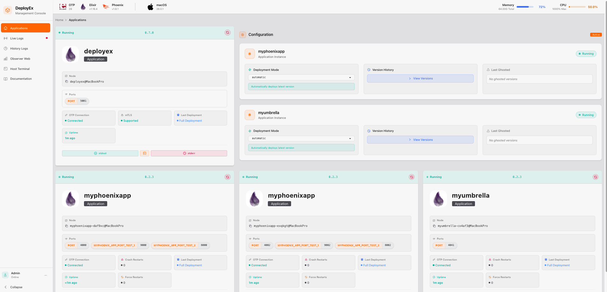
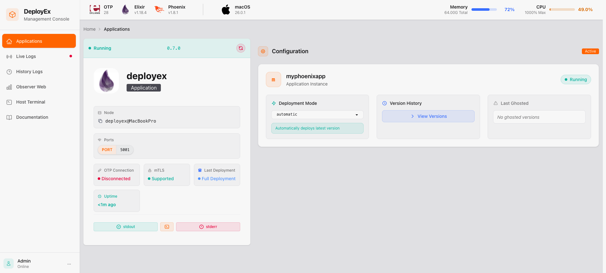

# DeployEx

> Who supervises the supervisor (of your application)?

 [](https://github.com/thiagoesteves/deployex/actions/workflows/pr-ci.yml)

DeployEx is a lightweight tool designed for managing deployments for Beam applications (Elixir, Gleam and Erlang) without relying on additional deployment tools like Docker or Kubernetes. Its primary goal is to utilize the release package for executing full deployments or hot-upgrades, depending on the package's content, while leveraging OTP distribution for monitoring and data extraction.

DeployEx acts as a central deployment runner, gathering crucial deployment data such as the current version and release package contents. The content of the release package enables it to run for a full deployment or a hot-upgrade. Meanwhile, on the development front, your CI/CD pipeline takes charge of crafting and updating packages for the target release. This integration ensures that DeployEx is always equipped with the latest packages, ready to facilitate deployments.

To learn more about DeployEx and the advantages of removing containerized abstractions from your deployment process, check out the talk [Bring back the power of Beam deployments with DeployEx](https://www.youtube.com/watch?v=MV4ROe6xmlI) at CODE BEAM America 2025.


Upon deployment, the following dashboard becomes available, providing easy access to logs, the terminal, process observability, and much more for both DeployEx and the monitored applications.



## 🔉 Features

- Monitors multiple Beam application nodes (Elixir/Erlang/Gleam) and automatically restarts them if they crash for any reason.
- Includes a backoff delay restart mechanism to prevent excessive restarts.
- Performs full deployments based solely on the release files generated by:
  - `mix release` for Elixir.
  - `gleam export` for Gleam.
  - `rebar3 as prod tar` for Erlang.
- Supports hot code reloading for:
  - Elixir application using the [Jellyfish][jyf] library.
  - Elixir umbrella applications using the [Jellyfish][jyf] library.
  - Erlang application using the [rebar3_appup_plugin](https://github.com/lrascao/rebar3_appup_plugin) plugin.
  - DeployEx itself (Isn't that awesome?)
- Supports the following cloud providers (with terraform files):
  - Amazon Web Services (AWS)
  - Google Cloud Platform (GCP)
- Supports local environments for non-cloud deployments
- Provides rollback functionality if a monitored app version remains unstable for 10 minutes (time configurable).
- Rolled-back monitored app versions are ghosted, preventing their redeployment.
- Ensures all nodes remain connected to the OTP distribution, including DeployEx itself.
- Supports OTP distribution with mutual TLS (mTLS) for secure monitoring of apps and DeployEx.
- Provides the ability to run pre-commands prior deployments for Database migrations or any other eval command.
- Provides a friendly UI that only authenticated users can access.
- Allows setting a previously configured version in the UI, enabling DeployEx to enforce deployment of a specific version.
- Supports individual application restarts via the UI, including DeployEx itself.
- Provides easy access to the application shell:
  - IEx shell for monitored Elixir apps and DeployEx.
  - Erlang shell for monitored Gleam/Erlang apps.
- Provides monitoring and restart mechanisms for host memory thresholds and beam statistics of monitored applications, including port, atom, and process metrics.
- Supports access to live log files (stdout and stderr) for both monitored apps and DeployEx.
- Supports observability for all connected applications via [Observer Web][owb].
- Supports safe tracing for all connected applications.
- Provides visualization of Host System memory and CPU usage.
- Provides easy access to the host shell (tmux).
- Provides script to be used with ubuntu/debian hosts to install/update and hotupgrade DeployEx.
- Provides status information per node:
  - OTP connectivity
  - Version history
  - Last deployment status
  - Number of crash restarts
  - Number of forced restarts
- And much more ...

> [!NOTE]
> All examples and deployments in this project use NGINX as a reverse proxy and load balancer. However, DeployEx does not depend on NGINX; it is used here purely for convenience.

## 🚀 **New Monitoring Feature!**

Your application is now better protected from crashes caused by excessive memory usage, port/atom exhaustion, or too many processes.

🧠 Curious why monitoring memory is essential?  
Check out this must-watch video:  
▶️ [Battling Memory Leaks: Tales from the Trenches at WhatsApp](https://youtu.be/NCgsTBeQbc8)

## ⚠️ What is coming next? 

[Roadmap](https://github.com/users/thiagoesteves/projects/4)

## 📁 Getting Started

Since OTP distribution is heavily used between the DeployEx and Monitored Applications, users must ensure that both applications are running the same OTP Major version to prevent compatibility issues and system malfunctions. DeployEx releases will contain binaries for the following OTP versions:

| DeployEx version                                                          |  |  |
| ------------------------------------------------------------------------- | ---------------------------------------------------------- | ---------------------------------------------------------- |
| [**0.8.0**](https://github.com/thiagoesteves/deployex/releases/tag/0.8.0) | **27.3.4.3**                                               | **28.1.1**                                                 |
| [**0.7.3**](https://github.com/thiagoesteves/deployex/releases/tag/0.7.3) | **27.3.4.3**                                               | **28.1.1** [1]                                             |
| [**0.7.2**](https://github.com/thiagoesteves/deployex/releases/tag/0.7.2) | **27.3.4.3**                                               | **28.1** [1]                                               |
| [**0.7.1**](https://github.com/thiagoesteves/deployex/releases/tag/0.7.1) | **27.3.4.3**                                               | **28.1** [1]                                               |
| [**0.7.0**](https://github.com/thiagoesteves/deployex/releases/tag/0.7.0) | **27.3.4.3**                                               | **28.1** [1]                                               |
| [**0.6.1**](https://github.com/thiagoesteves/deployex/releases/tag/0.6.1) | **27.3.4.2**                                               | **28.0.2** [1]                                             |
| [**0.6.0**](https://github.com/thiagoesteves/deployex/releases/tag/0.6.0) | **27.3.4.2**                                               | **28.0.2** [1]                                             |

- **[1]** - Binaries for `OTP-28` are compiled with Elixir [1.18.4-otp-27](https://github.com/elixir-lang/elixir/releases/tag/v1.18.4)

### Running the application

You can kickstart the setup with the following commands, the default number of replicas is 3:

```bash
mix deps.get
iex --sname deployex --cookie cookie -S mix phx.server
Erlang/OTP 27 [erts-15.2.7] [source] [64-bit] [smp:10:10] [ds:10:10:10] [async-threads:1] [jit]

[info] Initializing Host Memory Server
[info] Initializing Engine Server for myphoenixapp
[info] Initializing Watchdog Server
[info] Running DeployexWeb.Endpoint with Bandit 1.6.11 at 127.0.0.1:5001 (http)
[info] Access DeployexWeb.Endpoint at http://localhost:5001
Interactive Elixir (1.17.0) - press Ctrl+C to exit (type h() ENTER for help)
[watch] build finished, watching for changes...

Rebuilding...

Done in 993ms.
[error] Error downloading release version for myphoenixapp, reason: {:error, :enoent}
[warning] No versions set yet for myphoenixapp
```

Now you can visit [`localhost:5001`](http://localhost:5001) from your browser and enter the credentials for the admin user, _**username: admin password: deployex**_. You should expect the following dashboard:



> [!NOTE]
> The error message in the CLI is due to no monitored app is available to be deployed. If you want to proceed for a local test, follow the steps at [Running DeployEx and Monitored app locally](https://github.com/thiagoesteves/deployex/tree/thi/add-erlang-hot-upgrade-support?tab=readme-ov-file#-running-deployex-locally). Also, it is important to note that the distribution will be required so this is the reason to add `-sname deployex` in the command

### How DeployEx handles monitored application Version/Release

The DeployEx app expects a `current.json` file to be available, which contains version, hash information and any pre-command. This file is mandatory for full deployment and hot upgrades.

#### Version file (current.json)

Expected location in the release folder:

```bash
# production path
./{bucket}/versions/{monitored_app}/{env}/current.json
# local test path
/tmp/deployex/bucket/versions/{monitored_app}/{env}/current.json
```

Expected JSON format for `current.json`:

```json
{
  "version": "1.0.0",
  "pre_commands": ["eval MyApp.Migrator.create", "eval MyApp.Migrator.migrate"], // optional field
  "hash": "local"
}
```

Once the file is captured, the deployment will start if no app is running or if the current app is running with a version that differs from the `current.json` file.

#### Release package

Expected location in the release folder:

```bash
# production path
./{bucket}/dist/{monitored_app}/{monitored_app}-{version}.tar.gz
# local test path
/tmp/deployex/bucket/dist/{monitored_app}/{monitored_app}-{version}.tar.gz
```

## 🛠️ Production Information

### Environment Variables

DeployEx application typically requires a few environment variables to be defined for proper operation. Ensure that you have the following environment variables set when running in production:

| ENV NAME                           | EXAMPLE                          |             SOURCE | DESCRIPTION                                               |
| ---------------------------------- | -------------------------------- | -----------------: | --------------------------------------------------------- |
| **DEPLOYEX_SECRET_KEY_BASE**       | 42otsNl...Fpq3dIJ02              | aws, gcp or env secrets | secret key used for encryption                            |
| **DEPLOYEX_ERLANG_COOKIE**         | cookie                           | aws, gcp or env secrets | erlang cookie                                             |
| **DEPLOYEX_ADMIN_HASHED_PASSWORD** | 2b1...42ASi                      | aws, gcp or env secrets | Hashed admin password for authentication                  |
| **DEPLOYEX_CONFIG_YAML_PATH**      | /home/ubuntu/deployex.yaml       |         system ENV      | Yaml configuration for Deployex and Monitored application |
| **DEPLOYEX_OTP_TLS_CERT_PATH**     | /usr/local/share/ca-certificates |         system ENV      | If using mTLS, the certificate PATH is needed             |

Once DeployEx runs, it fetches the configuration from the YAML file described in the session [YAML Management](guides/examples/yaml-runtime-upgrade/README.md). For local testing, these variables are not expected or set to default values.

### ☁️ Cloud Providers

DeployEx offers a comprehensive set of Terraform examples for programmatically deploying in AWS and GCP, including detailed step-by-step setup instructions:

- [AWS deployment for Elixir](guides/examples/aws-elixir/README.md)
- [GCP deployment for Elixir](guides/examples/gcp-elixir/README.md)
- [AWS deployment for Gleam](guides/examples/aws-gleam/README.md)

### Installation

If you intend to install DeployEx directly on an Ubuntu server, you can utilize the [deployex script](/devops/installer/deployex.sh) provided in the release package. This script is able to `install`, `update` and `hot-upgrade` DeployEx.

```bash
Usage:
  ./deployex.sh --install [config_file] [--dist <base_url>]
  ./deployex.sh --update [config_file] [--dist <base_url>]
  ./deployex.sh --uninstall [config_file]
  ./deployex.sh --hot-upgrade <release_path> [config_file]
  ./deployex.sh --help
```

For an example of monitored app, please see the setup for the [Calori Web Server - AWS](https://github.com/thiagoesteves/calori/blob/main/devops/aws/terraform/modules/standard-account/cloud-config.tpl)/[Calori Web Server - GCP](https://github.com/thiagoesteves/calori/blob/main/devops/gcp/terraform/modules/standard-account/cloud-config.tpl). The installer script requires a YAML configuration file, an example of which can be found [here](/devops/installer/deployex-aws.yaml). This YAML file can also export environment variables specific to the monitored applications.

Currently, the release and installation process supports **Ubuntu version 24.04**. However, you have the option to manually compile and install DeployEx on your target system.

#### 🔥 Hot-Upgrades

This feature can be applied to monitored apps and to DeployEx itself. There are many considerations before using hot-upgrades, and the decision of when to apply them is up to each project. DeployEx uses [Jellyfish][jyf] to generate appup files automatically, which can be modified or created manually if you want to add more actions. Sometimes it's better to start by looking at what you cannot hot-upgrade, then analyze the other changes in the release. The `Jellyfish + DeployEx` package has some limitations that may change over time, so stay tuned for these recommendations.

**DO NOT HOT-UPGRADE if:**
 * The new release is updating Elixir and/or Erlang OTP
 * The new release is updating/adding/removing libraries (there is a feature in progress in Jellyfish for updating specific libraries)
 * The new release changed the `runtime.exs` file
 * The new release changed config_provider files

Keep in mind that most of your releases will not require full deployment. You don't update OTP or libraries frequently, but you can combine hot-upgrades with migrations to avoid downtime, and much more. This topic is very vast, and we encourage you to apply and learn. High availability is a feature that doesn't come for free and require learning process.

If you want to hot-upgrade DeployEx itself, check the [GitHub action to create releases with hotupgrade](/.github/workflows/hot_upgrade.yaml) to see how you can create a release that can hot-upgrade from a specific version. Additional information can be found in the Changelog of DeployEx releases, where you can analyze whether the version you are running can be hot-upgraded to the latest one.

To see an example of hot-upgrading your monitored applications using GitHub CI, check out [this workflow](https://github.com/thiagoesteves/calori/blob/main/.github/workflows/hot-upgrade.yaml). The job fetches the `current.json` file, uses the latest deployed SHA to checkout the current version, compiles it, then switches to the target version, compiles again, and generates a release with the hot-upgrade information.

### Pre-commands (Elixir only)

Your application will likely require database commands, such as migrations. DeployEx handles these through pre-commands specified in `current.json` under the `pre_commands` field. These commands will be executed in the order they are listed, before the application starts. If a pre-command is needed and does not require changes to the application itself, using pre-commands in conjunction with hotupgrade is ideal to avoid unnecessary downtime.

### 🔐 Secrets Requirements

DeployEx uses Secret Manager (AWS or GCP) to fetch its secrets via the config provider. The following environment variable configuration is expected for Secret Manager:

```bash
DEPLOYEX_SECRETS_ADAPTER=gcp
DEPLOYEX_SECRETS_PATH=deployex-myapp-prod-secrets
```

Within the secrets, the following key-value pairs are required:
| ENV NAME | EXAMPLE | DESCRIPTION |
|----------|-------------|------|
| **DEPLOYEX_SECRET_KEY_BASE** | 42otsNl...Fpq3dIJ02 | mix phx.gen.secret |
| **DEPLOYEX_ERLANG_COOKIE** | my-cookie | erlang cookie |
| **DEPLOYEX_ADMIN_HASHED_PASSWORD** | $2b$1...5PAYTZjNQ42ASi | Bcrypt.hash_pwd_salt("my-pass") |

## 🏠 Local Development & Application Setup

Learn how to run DeployEx locally and configure your application for mTLS, hot upgrades, and metrics:

- [Elixir Application - No Ecto](guides/examples/local-elixir/README.md)
- [Elixir Application - With Ecto](guides/examples/local-elixir-ecto/README.md)
- [Elixir Umbrella Application - No Ecto](guides/examples/local-elixir-umbrella/README.md)
- [Gleam Application](guides/examples/local-gleam/README.md)
- [Erlang Application](guides/examples/local-erlang/README.md)

### Recommended Supporting Repositories

For local testing and development, check out these complementary repositories:

- [Elixir - myphoenixapp](https://github.com/thiagoesteves/myphoenixapp)
- [Elixir - myumbrella](https://github.com/thiagoesteves/myumbrella)
- [Elixir - ectoapp](https://github.com/thiagoesteves/ectoapp)

## 🔨 Throubleshooting

### Accessing DeployEx logs

```bash
# production
tail -f /var/log/deployex/deployex-stdout.log
tail -f /var/log/deployex/deployex-stderr.log
# local test
# not available when running as dev env
```

### Connecting to the DeployEx IEX CLI

```bash
export RELEASE_COOKIE=cookie
# production
/opt/deployex/bin/deployex remote
# local test
# not available when running as dev env
```

### Accessing monitored app logs

```bash
export monitored_app_name=myphoenixapp
export sname="${monitored_app_name}-2l0rkp"

# production
tail -f /var/log/monitored-apps/${monitored_app_name}/${sname}-stdout.log
tail -f /var/log/monitored-apps/${monitored_app_name}/${sname}-stderr.log
# local test
tail -f /tmp/deployex/varlog/${monitored_app_name}/${sname}-stdout.log
tail -f /tmp/deployex/varlog/${monitored_app_name}/${sname}-stderr.log
```

### Connecting to the monitored app manually

#### Elixir

```bash
export monitored_app_name=myphoenixapp
export sname="${monitored_app_name}-v636fq"
export RELEASE_NODE=${sname}
export RELEASE_COOKIE=cookie
# production
/var/lib/deployex/service/${monitored_app_name}/${sname}/current/bin/${monitored_app_name} remote
# local test
/tmp/deployex/varlib/service/${monitored_app_name}/${sname}/current/bin/${monitored_app_name} remote
```

#### Gleam

```bash
export monitored_app_name=mygleamapp
export sname="${monitored_app_name}-v636fq"
export hostname=???? # From the local machine
export ssl_options="-proto_dist inet_tls -ssl_dist_optfile /tmp/inet_tls.conf" # If enabled
# production
erl -remsh ${sname}@${hostname} -setcookie cookie ${ssl_options}
# local test
erl -remsh ${sname}@${hostname} -setcookie cookie ${ssl_options}
```

#### Erlang

```bash
export monitored_app_name=myerlangapp
export sname="${monitored_app_name}-ly8tmo"
export RELX_REPLACE_OS_VARS=true
export RELEASE_NODE=${sname}
export RELEASE_COOKIE=cookie
export RELEASE_SSL_OPTIONS="-proto_dist inet_tls -ssl_dist_optfile /tmp/inet_tls.conf" # If enabled
# production
/var/lib/deployex/service/${monitored_app_name}/${sname}/current/bin/${monitored_app_name} remote_console
# local test
/tmp/deployex/varlib/service/${monitored_app_name}/${sname}/current/bin/${monitored_app_name} remote_console
```

## ❓How DeployEx handles services

DeployEx operates by monitoring applications and versions using folders and files, treating the monitored app as a service:

```bash
# test environment
/tmp/deployex/varlib/service/${monitored_app}/${sname}/previous/${monitored_app}
/tmp/deployex/varlib/service/${monitored_app}/${sname}/new/${monitored_app}
/tmp/deployex/varlib/service/${monitored_app}/${sname}/current/${monitored_app}
```

```bash
# production environment
/var/lib/deployex/service/${monitored_app}/${sname}/previous/${monitored_app}
/var/lib/deployex/service/${monitored_app}/${sname}/new/${monitored_app}
/var/lib/deployex/service/${monitored_app}/${sname}/current/${monitored_app}
```

## 🗨️ Getting involved

☎️ **Contact us:**
Feel free to contact me on [Linkedin](https://www.linkedin.com/in/thiago-cesar-calori-esteves-972368115/).

## ©️ Copyright and License

Copyright (c) 2024, Thiago Esteves.

DeployEx source code is licensed under the [MIT License](LICENSE.md).

[jyf]: https://github.com/thiagoesteves/jellyfish
[owb]: https://github.com/thiagoesteves/observer_web
