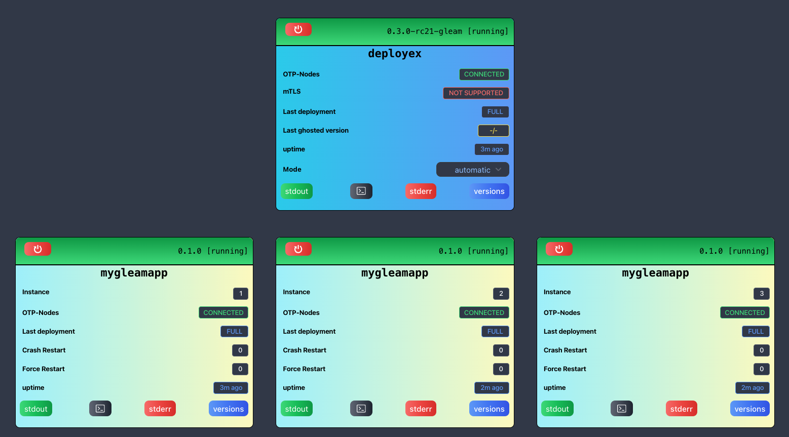
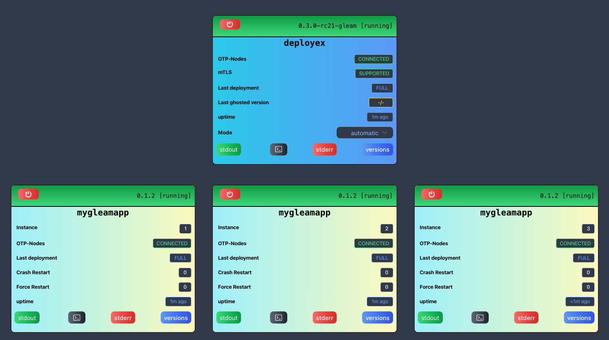

# 🏠 Running DeployEx and Monitored Gleam Application locally

For local testing, the root path used for distribution releases and versions is `/tmp/{monitored_app}`. Let's create the required release folders:
```bash
export monitored_app_name=mygleamapp
mkdir -p /tmp/${monitored_app_name}/dist/${monitored_app_name}
mkdir -p /tmp/${monitored_app_name}/versions/${monitored_app_name}/local/
```

Since Elixir is the default language for deployex, it will require set the respective values in the same terminal where deployex will run:
```bash
export DEPLOYEX_MONITORED_APP_NAME=mygleamapp
export DEPLOYEX_MONITORED_APP_LANG=gleam
```

It is important to note that for local deployments, DeployEx will use the path `/tmp/deployex` for local storage. This means you can delete the entire folder to reset any local version, history, or configurations.

## Creating a Gleam app (default name is `mygleamapp`)

In this example, we create a brand new gleam app:

```bash
gleam new mygleamapp
cd mygleamapp
```

Add the following dependency (gleam_erlang) at `gleam.toml`:
```gleam
[dependencies]
gleam_stdlib = ">= 0.34.0 and < 2.0.0"
gleam_erlang = ">= 0.27.0 and < 1.0.0"
```

Modify the main function to sleep forever at `src/mygleamapp.gleam`, otherwise the application will run and exit:

```gleam
import gleam/io
import gleam/erlang/process

pub fn main() {
  io.println("Hello from mygleamapp!")
  process.sleep_forever()
}
```

## Generate a release
Then you can compile and generate a release
```bash
gleam deps update
gleam export erlang-shipment
```

Pack the release and move it to the distributed folder and updated the version:
```bash
cd build
export app_name=mygleamapp
export release_path=erlang-shipment
tar -czvf ${release_path}/${app_name}-0.1.0.tar.gz ${release_path}
cp ${release_path}/${app_name}-0.1.0.tar.gz /tmp/${app_name}/dist/${app_name}
echo "{\"version\":\"0.1.0\",\"pre_commands\": [],\"hash\":\"local\"}" | jq > /tmp/${app_name}/versions/${app_name}/local/current.json
```

> [!NOTE]
> Gleam doesn't have a release command (yet). For DeployEx to operate properly, we need a tarbal that contains the erlang-shipment
> with the respective version. There is an example in [cochito](https://github.com/chouzar/cochito/blob/main/.github/workflows/release.yml)

## Running DeployEx and deploy the app

Move back to the DeployEx project and run the command line with the required ENV vars. 

*__NOTE:  All env vars that are available for DeployEx will also be available to the `monitored_app`__*
```bash
export DEPLOYEX_MONITORED_APP_NAME=mygleamapp
export DEPLOYEX_MONITORED_APP_LANG=gleam
export SECRET_KEY_BASE=e4CXwPpjrAJp9NbRobS8dXmOHfn0EBpFdhZlPmZo1y3N/BzW9Z/k7iP7FjMk+chi
export PHX_SERVER=true
iex --sname deployex --cookie cookie -S mix phx.server
...

[info] Update is needed at instance: 1 from: <no current set> to: 0.1.0
[warning] HOT UPGRADE version NOT DETECTED, full deployment required, result: []
[info] Full deploy instance: 1 deploy_ref: 9k416t
[info] Initialising monitor server for instance: 1
[info] Ensure running requested for instance: 1 version: 0.1.0
[info]  # Identified executable: /tmp/deployex/varlib/service/mygleamapp/1/current/erlang-shipment
[info]  # Starting application
[info]  # Running instance: 1, monitoring pid = #PID<0.819.0>, OS process = 87157 deploy_ref: 9k416t
[info]  # Application instance: 1 is running
[info]  # Moving to the next instance: 2
...
iex(deployex@hostname)1>
```

You should then visit the application and check it is running [localhost:5001](http://localhost:5001/). Since you are not using mTLS, the dashboard should look like this:



Note that the __OTP-Nodes are connected__, but the __mTLS is not supported__. The __mTLS__ can be enabled and it will be covered ahead. Leave this terminal running and open a new one to compile and release the monitored app.

## Updating the application

### Full deployment

In this scenario, the existing application will undergo termination, paving the way for the deployment of the new one. It's crucial to maintain the continuous operation of DeployEx throughout this process. Navigate to the `mygleamapp` project and increment the version in the `gleam.toml` file.

1. Remove any previously generated files and generate a new release
```bash
gleam export erlang-shipment
```

2. Now, *__keep DeployEx running in another terminal__* and copy the release file to the distribution folder and proceed to update the version accordingly:
```bash
export app_name=mygleamapp
export release_path=erlang-shipment
cd build
tar -czvf ${release_path}/${app_name}-0.1.1.tar.gz ${release_path}
cp ${release_path}/${app_name}-0.1.1.tar.gz /tmp/${app_name}/dist/${app_name}
echo "{\"version\":\"0.1.1\",\"pre_commands\": [],\"hash\":\"local\"}" | jq > /tmp/${app_name}/versions/${app_name}/local/current.json
```

3. You should then see the following messages in the DeployEx terminal while updating the app:
```bash
[info] Update is needed at instance: 1 from: 0.1.0 to: 0.1.1
[warning] HOT UPGRADE version NOT DETECTED, full deployment required, result: []
[info] Full deploy instance: 1 deploy_ref: xkmmz7
[info] Requested instance: 1 to stop application pid: #PID<0.819.0>
[info] Initialising monitor server for instance: 1
[info] Ensure running requested for instance: 1 version: 0.1.1
[info]  # Identified executable: /tmp/deployex/varlib/service/mygleamapp/1/current/erlang-shipment
[info]  # Starting application
[info]  # Running instance: 1, monitoring pid = #PID<0.1455.0>, OS process = 88828 deploy_ref: xkmmz7
[info]  # Application instance: 1 is running
[info]  # Moving to the next instance: 2
...
```

## 🔑 Enhancing OTP Distribution Security with mTLS

In order to improve security, mutual TLS (`mTLS` for short) can be employed to encrypt communication during OTP distribution. To implement this, follow these steps:

1. Generate the necessary certificates, DeployEx has a good examples of how to create self-signed tls certificates:
```bash
cd deployex
make tls-distribution-certs
```

2. Copy the generated certificates to the `/tmp` folder:
```bash
cp ca.crt /tmp
cp deployex.crt /tmp
cp deployex.key /tmp
```

3. Create the `inet_tls.conf` file with the appropriate paths, utilizing the command found in `rel/env.sh.eex` in deployex project:
```bash
export DEPLOYEX_OTP_TLS_CERT_PATH=/tmp

test -f /tmp/inet_tls.conf || (umask 277
 cd /tmp
 cat >inet_tls.conf <<EOF
[
  {server, [
    {certfile, "${DEPLOYEX_OTP_TLS_CERT_PATH}/deployex.crt"},
    {keyfile, "${DEPLOYEX_OTP_TLS_CERT_PATH}/deployex.key"},
    {cacertfile, "${DEPLOYEX_OTP_TLS_CERT_PATH}/ca.crt"},
    {verify, verify_peer},
    {secure_renegotiate, true}
  ]},
  {client, [
    {certfile, "${DEPLOYEX_OTP_TLS_CERT_PATH}/deployex.crt"},
    {keyfile, "${DEPLOYEX_OTP_TLS_CERT_PATH}/deployex.key"},
    {cacertfile, "${DEPLOYEX_OTP_TLS_CERT_PATH}/ca.crt"},
    {verify, verify_peer},
    {secure_renegotiate, true},
    {server_name_indication, disable}
  ]}
].
EOF
)
```

4. To enable `mTLS` for DeployEx, set the appropriate Erlang options before running the application in the terminal:
```bash
ELIXIR_ERL_OPTIONS="-proto_dist inet_tls -ssl_dist_optfile /tmp/inet_tls.conf -setcookie cookie" iex --sname deployex -S mix phx.server
```

After making these changes, create and publish a new version `0.1.2` for `mygleamapp` and run the DeployEx with the command from item 5. After the deployment, you should see the following dashboard:

