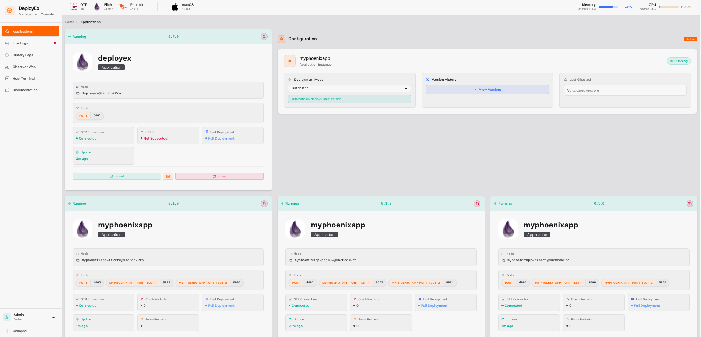

## 1. Running DeployEx and Monitored Elixir Umbrella Application locally

For local testing, the root path used for distribution releases and versions is `/tmp/deployex/bucket`. Follow these steps:

Create the required release folders:
```bash
export monitored_app_name=myumbrella
mkdir -p /tmp/deployex/bucket/dist/${monitored_app_name}
mkdir -p /tmp/deployex/bucket/versions/${monitored_app_name}/local/
```

It is important to note that for local deployments, DeployEx will use the path `/tmp/deployex/varlib` for local storage. This means you can delete the entire folder to reset any local version, history, or configurations.

## 2. Creating an Elixir phoenix umbrella app (default name is `myumbrella`)

In this example, we create a brand new application using `mix phx.new` and added the library [Jellyfish](https://github.com/thiagoesteves/jellyfish) for testing hotupgrades.

> [!NOTE]
> A project [myumbrella](https://github.com/thiagoesteves/myumbrella) is also available for consulting

```bash
mix local.hex
mix archive.install hex phx_new
mix new myumbrella --umbrella
cd myumbrella/apps
mix new app1 --sup
mix new app2 --sup
mix phx.new app_web --no-ecto
```

## 3. Add env.sh.eex file in the release folder to configure the OTP distribution

```bash
vi rel/env.sh.eex
# Add the following lines:

#!/bin/sh
# Set a default Erlang cookie value if not provided by ENV VAR.
# This default is temporary; update it using AWS secrets and config provider.
[ -z ${RELEASE_COOKIE} ] && export RELEASE_COOKIE="cookie"
export RELEASE_DISTRIBUTION=sname

# save the file :wq
```

## 4. Configuring your app to allow Hot upgrades (optional)
Add the [Jellyfish](https://github.com/thiagoesteves/jellyfish) library __ONLY__
if your application will need hot upgrades. The dependency should be added at the 
root path (not in specific apps). For umbrella applications, check the [Umbrella Support](https://github.com/thiagoesteves/jellyfish?tab=readme-ov-file#elixir-umbrella-applications)
documentation to learn how to share the same version between apps and properly
enable hot upgrades across the entire umbrella.

```elixir
def deps do
  [
    {:jellyfish, "~> 0.2.0"}
  ]
end
```

You also need to add the following line in the mix project
```elixir
  def project do
    [
      ...
      releases: [
        myumbrella: [
          applications: [
            app_1: :permanent,
            app_2: :permanent,
            app_web: :permanent
          ],
          steps: [:assemble, &Jellyfish.generate/1, :tar]
        ]
      ],
      ...
    ]
  end
```

Also, make sure you have added the `runtime_tools` to the release so DeployEx can have access to tracing via Observer Web (For umbrella apps, you can add it to any of them):
```elixir
  def application do
    [
      mod: {AppWebWeb.Application, []},
      extra_applications: [:logger, :runtime_tools]
    ]
  end
```

Open the `config/prod.exs` and replace the static manifest for a live reload

```elixir
# before starting your production server.
# config :app_web, AppWebWeb.Endpoint, cache_static_manifest: "priv/static/cache_manifest.json"
config :app_web, AppWebWeb.Endpoint,
  live_reload: [
    patterns: [
      ~r"priv/static/.*(js|css|png|jpeg|jpg|gif|svg)$",
      ~r"priv/gettext/.*(po)$"
    ]
  ]
```

## 5. Configuring your app as broadcast mode publishing metrics to DeployEx (optional)
Add [Observer Web](https://github.com/thiagoesteves/observer_web) to one of your applications, 
preferably the Phoenix application. This allows your application to broadcast metrics that 
can be collected and visualized by DeployEx.

```elixir
def deps do
  [
    {:observer_web, "~> 0.1.0"}
  ]
end
```

Open the `config/config.exs` and add the following configuration
```elixir
config :observer_web, ObserverWeb.Telemetry,
  mode: :broadcast
```

## 6. Generate a release
Then you can compile and generate a release
```bash
mix deps.get
MIX_ENV=prod mix assets.deploy
MIX_ENV=prod mix release
...
==> app_web
Check your digested files at "priv/static"
* assembling myumbrella-0.1.0 on MIX_ENV=prod
* using config/runtime.exs to configure the release at runtime
* creating _build/prod/rel/myumbrella/releases/0.1.0/env.sh
* hot-upgrade Checking if previous versions are available
==> app_1
 versions: ["0.1.0"] current: 0.1.0 - No appups
==> app_2
 versions: ["0.1.0"] current: 0.1.0 - No appups
==> app_web
 versions: ["0.1.0"] current: 0.1.0 - No appups
* hot-upgrade copying release file to /Users/testeves/Workspace/Esl/myumbrella/_build/prod/rel/myumbrella/releases/myumbrella-0.1.0.rel
* building /Users/testeves/Workspace/Esl/myumbrella/_build/prod/myumbrella-0.1.0.tar.gz
```

Move the release file to the distributed folder and updated the version:
```bash
export app_name=myumbrella
cp _build/prod/${app_name}-0.1.0.tar.gz /tmp/deployex/bucket/dist/${app_name}
echo "{\"version\":\"0.1.0\",\"pre_commands\": [],\"hash\":\"local\"}" | jq > /tmp/deployex/bucket/versions/${app_name}/local/current.json
```

## 7. Running DeployEx and deploy the app

### Adding an Elixir Monitored Application

The default `dev` application for deployex is `myphoenixapp`. To add another application to monitoring, update the `config/dev.exs` file:

```elixir
config :foundation,
  env: "local",
  base_path: "/tmp/deployex/varlib",
  monitored_app_log_path: "/tmp/deployex/varlog",
  applications: [
    %{
      name: "myumbrella",
      replicas: 2,
      language: "elixir",
      replica_ports: [%{key: "PORT", base: 4000}],
      env: []
    }
  ]
```

### Running DeployEx

> [!ATTENTION]
> The file `config/dev.exs` contains defaults for local development. Note that these configurations only apply to development environments; production environments require configuration via YAML file.

Move back to the DeployEx project and run the command line:

```bash
iex --sname deployex --cookie cookie -S mix phx.server
...

[info] Update is needed at sname: myumbrella-v636fq from: <no current set> to: 0.1.0
[warning] HOT UPGRADE version NOT DETECTED, full deployment required, reason: :not_found
[info] Full deploy instance: 1 sname: myumbrella-ud48pz
[info] Initializing monitor server for sname: myumbrella-ud48pz language: elixir
[info] Ensure running requested for sname: myumbrella-ud48pz version: 0.1.0
[info]  # Identified executable: /tmp/deployex/varlib/service/myumbrella/myumbrella-ud48pz/current/bin/myumbrella
[info]  # Starting application
[info]  # Running sname: myumbrella-ud48pz, monitoring pid = #PID<0.3037.0>, OS process = 6479 sname: myumbrella-ud48pz
[info]  # Application sname: myphoenixapp-ud48pz is running
[info]  # Moving to the next instance: 2
...
iex(deployex@hostname)1>
```

You should then visit the application and check it is running [localhost:5001](http://localhost:5001/). Since you are not using mTLS, the dashboard should look like this:



Note that the __OTP-Nodes are connected__, but the __mTLS is not supported__. The __mTLS__ can be enabled and it will be covered ahead. Leave this terminal running and open a new one to compile and release the monitored app.

## 8. Updating the application

### Full deployment

In this scenario, the existing application will undergo termination, paving the way for the deployment of the new one. It's crucial to maintain the continuous operation of DeployEx throughout this process. Navigate to the `myumbrella` project and increment the version in the `mix.exs` file. Typically, during release execution, the CI/CD pipeline either generates the package from scratch or relies on the precompiled version, particularly for hot-upgrades. If you've incorporated the [Jellyfish](https://github.com/thiagoesteves/jellyfish) library and wish to exclusively create the full deployment package, for this test you must follow the steps: 

1. Remove any previously generated files and generate a new release
```bash
cp myumbrella
rm -rf _build/prod
MIX_ENV=prod mix assets.deploy
MIX_ENV=prod mix release
...
Generated myumbrella app
No appups, nothing to move to the release
Check your digested files at "priv/static"
No appups, nothing to move to the release
* assembling myumbrella-0.1.1 on MIX_ENV=prod
* using config/runtime.exs to configure the release at runtime
* hot-upgrade copying release file to /Users/testeves/Workspace/Esl/myumbrella/_build/prod/rel/myumbrella/releases/myumbrella-0.1.1.rel
* building /Users/testeves/Workspace/Esl/myumbrella/_build/prod/myumbrella-0.1.1.tar.gz
```

2. Now, *__keep DeployEx running in another terminal__* and copy the release file to the distribution folder and proceed to update the version accordingly:
```bash
export app_name=myumbrella
cp _build/prod/${app_name}-0.1.1.tar.gz /tmp/deployex/bucket/dist/${app_name}
echo "{\"version\":\"0.1.1\",\"pre_commands\": [],\"hash\":\"local\"}" | jq > /tmp/deployex/bucket/versions/${app_name}/local/current.json
```

3. You should then see the following messages in the DeployEx terminal while updating the app:
```bash
[info] Update is needed at sname: myumbrella-ud48pz from: 0.1.0 to: 0.1.1
[warning] HOT UPGRADE version NOT DETECTED, full deployment required, reason: :not_found
[info] Full deploy instance: 1 sname: myumbrella-1j535g
[info] Requested sname: myumbrella-ipzc1l to stop application pid: #PID<0.1392.0>
[warning] Remaining beam app removed for sname: myumbrella-ipzc1l
[info] Initializing monitor server for sname: myumbrella-1j535g language: elixir
[info] Ensure running requested for sname: myumbrella-1j535g version: 0.1.1
[info]  # Identified executable: /tmp/deployex/varlib/service/myumbrella/myumbrella-1j535g/current/bin/myumbrella
[info]  # Starting application
[info]  # Running sname: myumbrella-1j535g, monitoring pid = #PID<0.3423.0>, OS process = 6967 sname: myumbrella-1j535g
[info]  # Application sname: myumbrella-1j535g is running
[info]  # Moving to the next instance: 2
...
```

### Hot-upgrades

For this scenario, the project must first be compiled to the current version and subsequently compiled for the version it's expected to update to. The `current.json` file deployed includes the git hash representing the current application version. In this local testing phase, it suffices to compile for the previous version, such as `0.1.1`, and the subsequent version, like `0.1.2`, so the necessary files will be automatically populated.

1. Since the application is already compiled for `0.1.1`, change the `mix.exs` to `0.1.2`, apply any other changes if you want to test and execute the command:
```bash
MIX_ENV=prod mix assets.deploy
MIX_ENV=prod mix compile --force
MIX_ENV=prod mix release
...
==> app_web
Check your digested files at "priv/static"
==> app_1
Compiling 3 files (.ex)
Generated app_1 app
==> app_2
Compiling 3 files (.ex)
Generated app_2 app
==> app_web
Compiling 13 files (.ex)
Generated app_web app
Release myumbrella-0.1.2 already exists. Overwrite? [Yn] Y
* assembling myumbrella-0.1.2 on MIX_ENV=prod
* using config/runtime.exs to configure the release at runtime
* creating _build/prod/rel/myumbrella/releases/0.1.2/env.sh
* hot-upgrade Checking if previous versions are available
==> app_1
 versions: ["0.1.1", "0.1.2"] current: 0.1.2 - appups: app_1/rel/appups/
==> app_2
 versions: ["0.1.1", "0.1.2"] current: 0.1.2 - appups: app_2/rel/appups/
==> app_web
 versions: ["0.1.1", "0.1.2"] current: 0.1.2 - appups: app_web/rel/appups/
* hot-upgrade copying release file to /Users/testeves/Workspace/Esl/myumbrella/_build/prod/rel/myumbrella/releases/myumbrella-0.1.2.rel
* building /Users/testeves/Workspace/Esl/myumbrella/_build/prod/myumbrella-0.1.2.tar.gz
```

2. Now, copy the release file to the distribution folder and proceed to update the version accordingly:
```bash
export app_name=myumbrella
cp _build/prod/${app_name}-0.1.2.tar.gz /tmp/deployex/bucket/dist/${app_name}
echo "{\"version\":\"0.1.2\",\"pre_commands\": [],\"hash\":\"local\"}" | jq > /tmp/deployex/bucket/versions/${app_name}/local/current.json
```

You can then check that DeployEx had executed a hot upgrade in the application:

```bash
[info] Update is needed at sname: myumbrella-1j535g from: 0.1.1 to: 0.1.2
[warning] HOT UPGRADE version DETECTED - [%{"from" => "0.1.1", "name" => "myumbrella", "to" => "0.1.2"}]
[info] Hot upgrade instance: 3 sname: myumbrella-1j535g
[info] Unpacked successfully: ~c"0.1.2"
[info] Installed Release: ~c"0.1.2"
[info] Made release permanent: 0.1.2
[info] Release upgrade executed with success at node: myumbrella-1j535g@MacBookPro from: 0.1.1 to: 0.1.2
[info]  # Moving to the next instance: 1
...
```

you can check that the version and the deployment status has changed in the dashboard to `Hot Upgrade`.

## 9. 🔑 Enhancing OTP Distribution Security with mTLS

In order to improve security, mutual TLS (`mTLS` for short) can be employed to encrypt communication during OTP distribution. To implement this, follow these steps:

1. Generate the necessary certificates, DeployEx has a good examples of how to create self-signed tls certificates:
```bash
cd deployex
./tls-distribution-certs
```

2. Copy the generated certificates to the `/tmp` folder:
```bash
cp ca.crt /tmp
cp deployex.crt /tmp
cp deployex.key /tmp
```

3. Create the `inet_tls.conf` file with the appropriate paths, utilizing the command found in `rel/env.sh.eex` in deployex project:
```bash
export DEPLOYEX_OTP_TLS_CERT_PATH=/tmp

test -f /tmp/inet_tls.conf || (umask 277
 cd /tmp
 cat >inet_tls.conf <<EOF
[
  {server, [
    {certfile, "${DEPLOYEX_OTP_TLS_CERT_PATH}/deployex.crt"},
    {keyfile, "${DEPLOYEX_OTP_TLS_CERT_PATH}/deployex.key"},
    {cacertfile, "${DEPLOYEX_OTP_TLS_CERT_PATH}/ca.crt"},
    {verify, verify_peer},
    {secure_renegotiate, true}
  ]},
  {client, [
    {certfile, "${DEPLOYEX_OTP_TLS_CERT_PATH}/deployex.crt"},
    {keyfile, "${DEPLOYEX_OTP_TLS_CERT_PATH}/deployex.key"},
    {cacertfile, "${DEPLOYEX_OTP_TLS_CERT_PATH}/ca.crt"},
    {verify, verify_peer},
    {secure_renegotiate, true},
    {server_name_indication, disable}
  ]}
].
EOF
)
```

4. Ensure that `myumbrella` also utilizes the same options and certificate by updating `rel/env.sh.eex`:
```bash
cd myumbrella
vi rel/env.sh.eex
# Add the following line
#!/bin/sh
export ELIXIR_ERL_OPTIONS="-proto_dist inet_tls -ssl_dist_optfile /tmp/inet_tls.conf"
# save the file :q
```

> [!ATTENTION]
> Since tls is enabled during the startup of the application, a full deploy is required, remove `_build` folder before `mix release`.

5. To enable `mTLS` for DeployEx, set the appropriate Erlang options before running the application in the terminal:
```bash
ELIXIR_ERL_OPTIONS="-proto_dist inet_tls -ssl_dist_optfile /tmp/inet_tls.conf -setcookie cookie" iex --sname deployex -S mix phx.server
```

After making these changes, create and publish a new version `0.1.3` for `myumbrella` and run the DeployEx with the command from item 5. After deployment, you should see in the dashboard that mTLS is `Supported` and both instances are `Connected`.

> [!ATTENTION]
> Ensure that the cookie is properly set