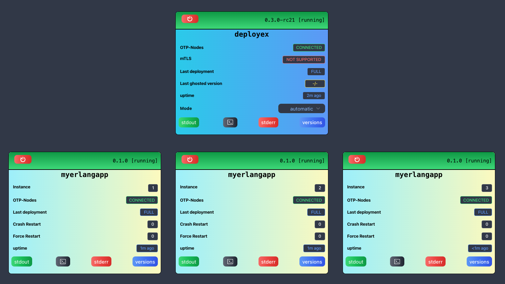
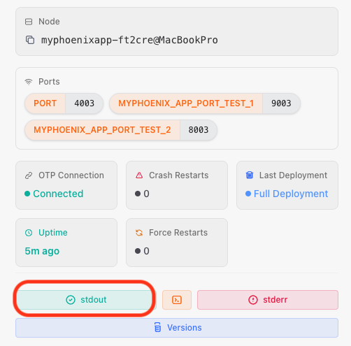
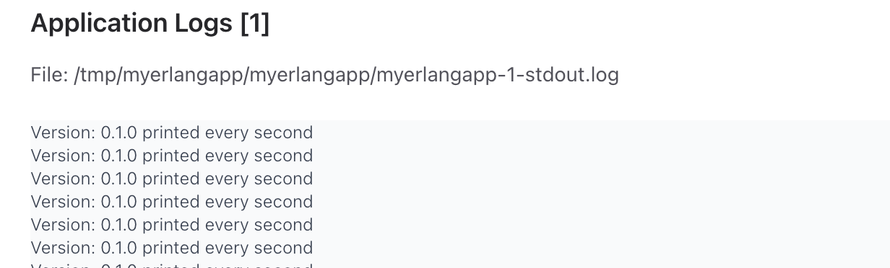
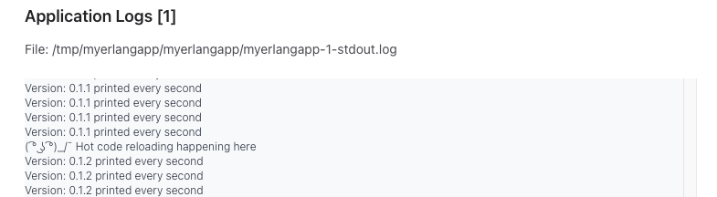
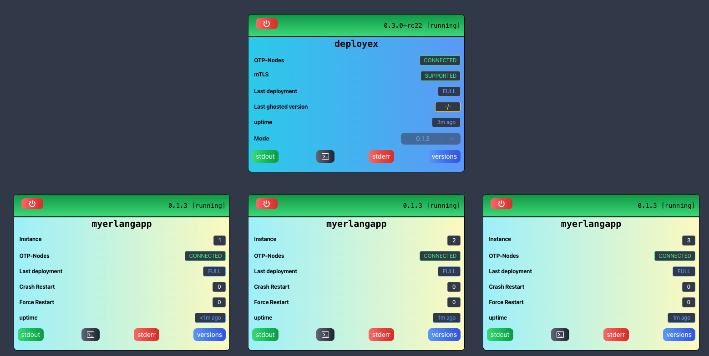

# 🏠 Running DeployEx and Monitored Erlang Application locally

For local testing, the root path used for distribution releases and versions is `/tmp/{monitored_app}`. Let's create the required release folders:
```bash
export monitored_app_name=myerlangapp
mkdir -p /tmp/${monitored_app_name}/dist/${monitored_app_name}
mkdir -p /tmp/${monitored_app_name}/versions/${monitored_app_name}/local/
```

Since Elixir is the default language for deployex, it will require set the respective values in the same terminal where deployex will run:
```elixir
export DEPLOYEX_MONITORED_APP_NAME=myerlangapp
export DEPLOYEX_MONITORED_APP_LANG=erlang
```

It is important to note that for local deployments, DeployEx will use the path `/tmp/deployex` for local storage. This means you can delete the entire folder to reset any local version, history, or configurations.

## Creating an Erlang app (default name is `myerlangapp`)

In this example, we create a brand new erlang app:

```bash
rebar3 new release myerlangapp
cd myerlangapp
```

### Add required release vars

Open the args file `config/vm.args` and add the following lines, removing previous suggestions for sname and cookie. These variables will be injected by DeployEx:

```bash
-sname ${RELEASE_NODE}
-setcookie ${RELEASE_COOKIE}
${RELEASE_SSL_OPTIONS}

+K true
+A30
```

Add the modules `inets` and `ssl` in the `apps/myerlangapp/src/myerlangapp.erl` file. They are required for distribution:

```bash
...
    {applications, [
        kernel,
        stdlib,
        inets, # <----
        ssl    # <----
    ]},
...
```

### Add required plugin for hot upgrades

Integrate the [rebar3 appup plugin](https://github.com/lrascao/rebar3_appup_plugin) adding the following commands at `rebar.config`:
```erlang
{plugins, [rebar3_appup_plugin]}.

{provider_hooks, [
    {pre, [{tar, {appup, tar}}]},
    {post, [{compile, {appup, compile}},
            {clean, {appup, clean}}]}
]}.
```

### Modify profile

Change the `prod` profile at `rebar.config`. This is required for rebar3 appup plugin:
```erlang
{profiles, [
    %% prod is the default mode when prod
    %% profile is used, so does not have
    %% to be explicitly included like this
    {prod, [
        {relx, [
            {dev_mode, false},
            {include_erts, true}

            %% use minimal mode to exclude ERTS
            %% {mode, minimal}
        ]}
    ]}
]}.
```

### Add gen_server for testing

Let's create a simple gen_server that prints its version message every second. Create the file `apps/myerlangapp/src/myerlangapp.erl` and populate with:

```erlang
-module(myerlangapp).
-behaviour(gen_server).

%% API
-export([start_link/0, stop/0]).

%% gen_server callbacks
-export([init/1, handle_call/3, handle_cast/2, handle_info/2, terminate/2, code_change/3]).

%% Starts the GenServer
start_link() ->
    gen_server:start_link(?MODULE, [], []).

%% Stops the GenServer
stop() ->
    gen_server:cast(?MODULE, stop).

%% Initialization
init([]) ->
    timer_send_message(),
    {ok, #{}}.

%% Handles synchronous calls
handle_call(_Request, _From, State) ->
    {reply, ok, State}.

%% Handles asynchronous casts
handle_cast(stop, State) ->
    {stop, normal, State}.

%% Handles info messages
handle_info(timeout, State) ->
    {_Name, _Description, Version} = lists:keyfind(myerlangapp, 1, application:loaded_applications()),
    io:format("Version: ~s printed every second~n", [Version]),
    timer_send_message(),
    {noreply, State};

handle_info(_Info, State) ->
    {noreply, State}.

%% Timer to send a message every second
timer_send_message() ->
    erlang:send_after(1000, self(), timeout).

%% Clean up on termination
terminate(_Reason, _State) ->
    ok.

%% Code change callback
code_change(_OldVsn, State, _Extra) ->
    {ok, State}.
```

Add the gen_server to the supervisor `apps/myerlangapp/src/myerlangapp_sup.erl`:

```erlang
init([]) ->
    SupFlags = #{
        strategy => one_for_all,
        intensity => 0,
        period => 1
    },
  ChildSpecs = [#{id => myerlangapp,
                  start => {myerlangapp, start_link, []},
                  restart => permanent,
                  type => worker,
                  shutdown => brutal_kill} ],
    {ok, {SupFlags, ChildSpecs}}.
```

## Generate a release
Then you can compile and generate a release
```bash
rebar3 as prod release
rebar3 as prod tar
```

Pack the release and move it to the distributed folder and updated the version:
```bash
export app_name=myerlangapp
cp _build/prod/rel/${app_name}/${app_name}-0.1.0.tar.gz /tmp/${app_name}/dist/${app_name}
echo "{\"version\":\"0.1.0\",\"pre_commands\": [],\"hash\":\"local\"}" | jq > /tmp/${app_name}/versions/${app_name}/local/current.json
```

## Running DeployEx and deploy the app

Move back to the DeployEx project and run the command line: 

> [!ATTENTION]
> The file `config/dev.exs` contains defaults for local development. You can modify environment variables by changing the `monitored_app_env` field. To customize the application name and language, use the environment variables `DEPLOYEX_MONITORED_APP_NAME` and `DEPLOYEX_MONITORED_APP_LANG`. Note that these environment variables and configurations only apply to development environments; production environments require configuration via YAML file.

```bash
export DEPLOYEX_MONITORED_APP_NAME=myerlangapp
export DEPLOYEX_MONITORED_APP_LANG=erlang
iex --sname deployex --cookie cookie -S mix phx.server
...

[info] Update is needed at instance: 1 from: <no current set> to: 0.1.0
[warning] HOT UPGRADE version NOT DETECTED, full deployment required, result: []
[info] Full deploy instance: 1 deploy_ref: psukd1
[info] Initialising monitor server for instance: 1
[info] Ensure running requested for instance: 1 version: 0.1.0
[info]  # Identified executable: /tmp/deployex/varlib/service/myerlangapp/1/current/bin/myerlangapp
[info]  # Starting application
[info]  # Running instance: 1, monitoring pid = #PID<0.790.0>, OS process = 22952 deploy_ref: psukd1
[info]  # Application instance: 1 is running
[info]  # Moving to the next instance: 2
...
iex(deployex@hostname)1>
```

You should then visit the application and check it is running [localhost:5001](http://localhost:5001/). Since you are not using mTLS, the dashboard should look like this:



You can also click in the stdout log button of `myerlangapp` to check the following message is being printed:




> [!NOTE]
> The __OTP-Nodes are connected__, but the __mTLS is not supported__. The __mTLS__ can be enabled and it will be covered ahead. Leave this terminal running and open a new one to compile and release the monitored app.

## Updating the application

### Full deployment

In this scenario, the existing application will undergo termination, paving the way for the deployment of the new one. It's crucial to maintain the continuous operation of DeployEx throughout this process. Navigate to the `myerlangapp` project and increment the version in the `apps/myerlangapp/src/myerlangapp.app.src` and `rebar.config` files to `0.1.1`

1. Remove any previously generated files and generate a new release
```bash
rm -rf _build/
rebar3 as prod release
rebar3 as prod tar
```

2. Now, *__keep DeployEx running in another terminal__* and copy the release file to the distribution folder and proceed to update the version accordingly:
```bash
export app_name=myerlangapp
cp _build/prod/rel/${app_name}/${app_name}-0.1.1.tar.gz /tmp/${app_name}/dist/${app_name}
echo "{\"version\":\"0.1.1\",\"pre_commands\": [],\"hash\":\"local\"}" | jq > /tmp/${app_name}/versions/${app_name}/local/current.json
```

3. You should then see the following messages in the DeployEx terminal while updating the app:
```bash
[info] Update is needed at instance: 1 from: 0.1.0 to: 0.1.1
[warning] HOT UPGRADE version NOT DETECTED, full deployment required, result: []
[info] Full deploy instance: 1 deploy_ref: oxnnwu
[info] Requested instance: 1 to stop application pid: #PID<0.790.0>
[info] Initialising monitor server for instance: 1
[info] Ensure running requested for instance: 1 version: 0.1.1
[info]  # Identified executable: /tmp/deployex/varlib/service/myerlangapp/1/current/bin/myerlangapp
[info]  # Starting application
[info]  # Running instance: 1, monitoring pid = #PID<0.852.0>, OS process = 23812 deploy_ref: oxnnwu
[info]  # Application instance: 1 is running
[info]  # Moving to the next instance: 2
...
```

### Hot Upgrade

#### Generating Appup Files

DeployEx is capable of executing hot upgrades using only the appup files. The Rebar3 appup plugin is capable of generating appup and relup files, but for compatibility, we are going to generate only the application appup files (excluding OTP, libraries, etc) and save the `appup` file in the `priv/appup` folder.

> [!ATTENTION]
> The Rebar3 appup plugin is not fully operation when using different profiles like `prod`, for this reason, we are going to use the default profile ONLY for creating the appup file and copy it to the `priv/appup` folder which will then be packed with the `prod` profile.

Create the folder (if doesn't exist) where the appup file will be stored and build the `default` release for the version `0.1.1` (This is the version where you want to upgrade from):
```bash
export app_name=myerlangapp
mkdir -p "apps/${app_name}/priv/appup"
rm -rf _build/
rebar3 release # Creating release for the version that will be upgrade from (default profile)
```

Update the project repository and/or make the changes for your app. Afterward, increment the version in both the `apps/myerlangapp/src/myerlangapp.app.src` and `rebar.config` files to `0.1.2`. As suggestion, you can add the following print in the `code_change` function of the `gen_server` at `apps/myerlangapp/src/myerlangapp.erl`:

```erlang
%% Code change callback
code_change(_OldVsn, State, _Extra) ->
    io:format("( ͡° ͜ʖ ͡°)_/¯ Hot code reloading happening here"),
    {ok, State}.
```

Let's then generate the `0.1.2` release with the appup file:
```bash
export app_name=myerlangapp
rebar3 as prod release
rebar3 as prod appup generate --previous "${PWD}/_build/default/rel/myerlangapp"  --target_dir "${PWD}/apps/${app_name}/priv/appup"
# ===> current base dir: "/home/ubuntu/myerlangapp/_build/default"
# ===> app myerlangapp ebin dir: "/home/ubuntu/myerlangapp/_build/default/lib/myerlangapp/ebin"
# ===> Generated appup ("0.1.1" <-> "0.1.2") for myerlangapp in "/home/ubuntu/myerlangapp/apps/myerlangapp/priv/appup/myerlangapp.appup"
rebar3 as prod tar
```

Copy the files in the respective folders:
```bash
export app_name=myerlangapp
cp _build/prod/rel/${app_name}/${app_name}-0.1.2.tar.gz /tmp/${app_name}/dist/${app_name}
echo "{\"version\":\"0.1.2\",\"pre_commands\": [],\"hash\":\"local\"}" | jq > /tmp/${app_name}/versions/${app_name}/local/current.json
```

you can check in the logs that the Hotupgrade was executed with success:


you can also restart the application to check that the hotupgrade persisted.

## 🔑 Enhancing OTP Distribution Security with mTLS

In order to improve security, mutual TLS (`mTLS` for short) can be employed to encrypt communication during OTP distribution. To implement this, follow these steps:

1. Generate the necessary certificates, DeployEx has a good examples of how to create self-signed tls certificates:
```bash
cd deployex
./tls-distribution-certs
```

2. Copy the generated certificates to the `/tmp` folder:
```bash
cp ca.crt /tmp
cp deployex.crt /tmp
cp deployex.key /tmp
```

3. Create the `inet_tls.conf` file with the appropriate paths, utilizing the command found in `rel/env.sh.eex` in deployex project:
```bash
export DEPLOYEX_OTP_TLS_CERT_PATH=/tmp

test -f /tmp/inet_tls.conf || (umask 277
 cd /tmp
 cat >inet_tls.conf <<EOF
[
  {server, [
    {certfile, "${DEPLOYEX_OTP_TLS_CERT_PATH}/deployex.crt"},
    {keyfile, "${DEPLOYEX_OTP_TLS_CERT_PATH}/deployex.key"},
    {cacertfile, "${DEPLOYEX_OTP_TLS_CERT_PATH}/ca.crt"},
    {verify, verify_peer},
    {secure_renegotiate, true}
  ]},
  {client, [
    {certfile, "${DEPLOYEX_OTP_TLS_CERT_PATH}/deployex.crt"},
    {keyfile, "${DEPLOYEX_OTP_TLS_CERT_PATH}/deployex.key"},
    {cacertfile, "${DEPLOYEX_OTP_TLS_CERT_PATH}/ca.crt"},
    {verify, verify_peer},
    {secure_renegotiate, true},
    {server_name_indication, disable}
  ]}
].
EOF
)
```

4. To enable `mTLS` for DeployEx, set the appropriate Erlang options before running the application in the terminal:
```bash
ELIXIR_ERL_OPTIONS="-proto_dist inet_tls -ssl_dist_optfile /tmp/inet_tls.conf -setcookie cookie" iex --sname deployex -S mix phx.server
```

After implementing these changes, create and publish a new version, `0.1.3`, for `myerlangapp`. Then, run DeployEx using the command from item 4. After deployment, you should see the following dashboard:

